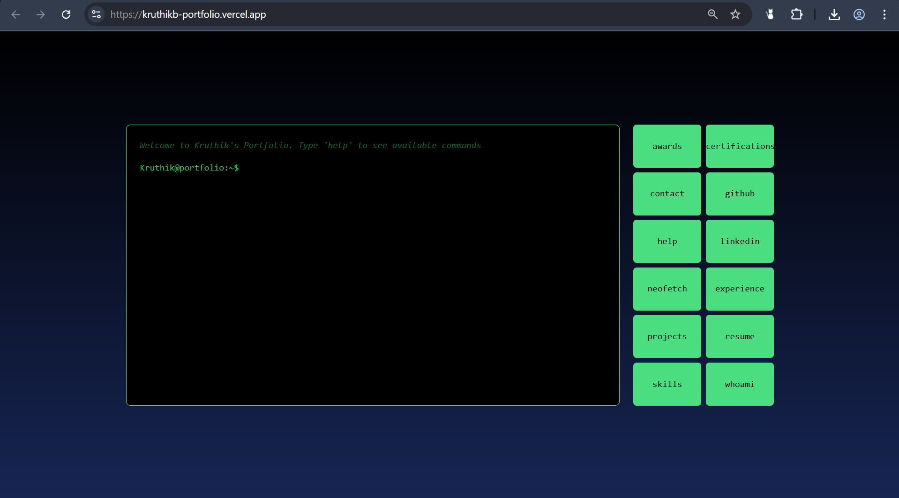
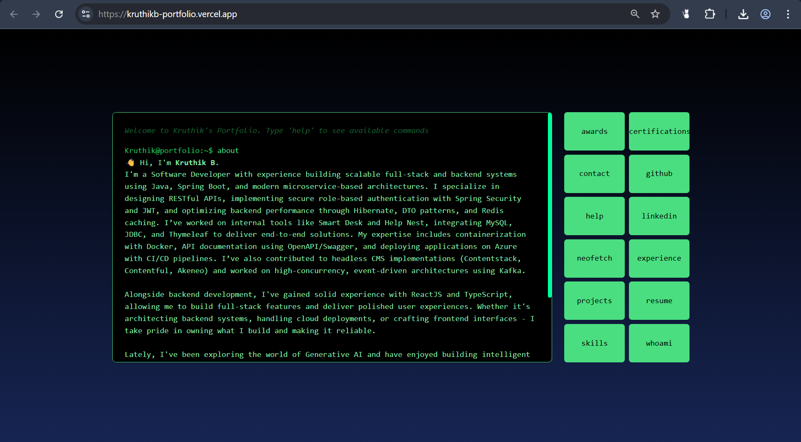
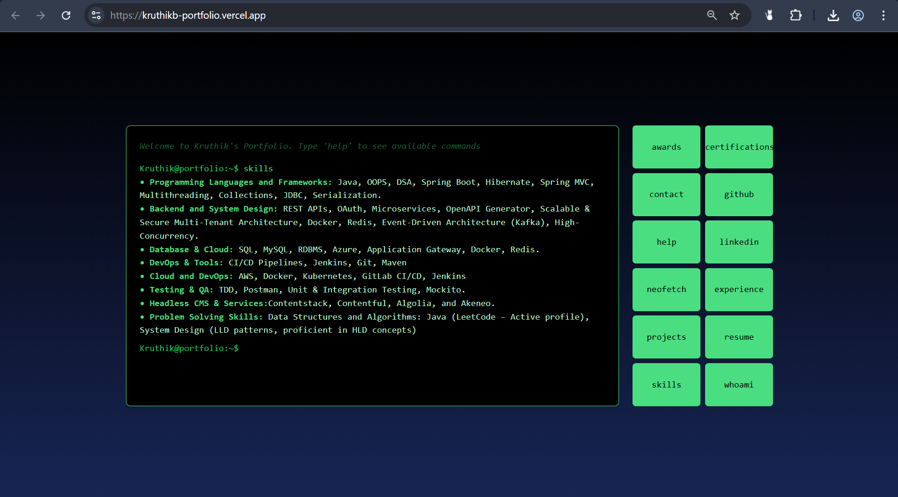
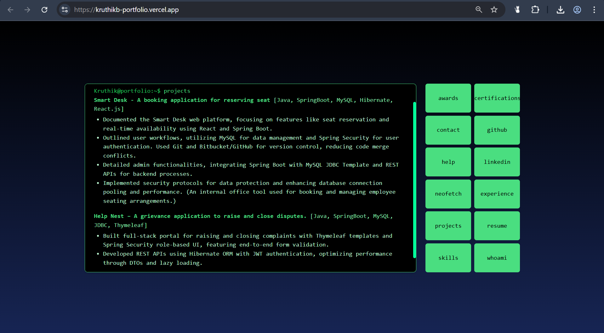

# 🖥️ Terminal Portfolio

A unique and interactive **command-line style portfolio website** built with **ReactJS** and **Tailwind CSS**.  
This project simulates a terminal environment where visitors can type predefined commands to explore my experience, skills, projects, and more — giving a retro yet modern twist to personal branding.

🔗 **Live Demo**: [https://kruthikb-portfolio.vercel.app/](https://kruthikb-portfolio.vercel.app/)
---

## 📑 Table of Contents

1. [📸 Screenshots](#-screenshots)  
2. [🧠 Commands Reference](#-commands-reference)  
3. [🚀 Features](#-features)  
4. [💻 Tech Stack](#-tech-stack)  
5. [🙋‍♂️ About the Author](#-about-the-author)  

---

## 📸 Screenshots

### 🔹 Initial Load  

### 🔹 Commands in Action  
- **About**  
  
- **Skills**  
  
- **Projects**  
  

---

## 🧠 Commands Reference

| Command          | Description                                        |
|------------------|----------------------------------------------------|
| `help`           | Lists all available commands                       |
| `about`          | Displays a short introduction about me            |
| `skills`         | Lists all the technologies and tools I use        |
| `experience`     | Displays my work experience in a timeline format  |
| `projects`       | Shows selected personal or work projects          |
| `certifications` | Lists certifications I've earned                  |
| `contact`        | Shows my contact info and social links            |
| `clear` / `cls`  | Clears the terminal history                       |
| *(invalid)*      | Shows a "Command not found" message               |

---

## 🚀 Features

- 🎨 **Terminal-like UI** with real-time input and blinking cursor  
- ✨ **Ghost text autocomplete** suggestions as you type  
- ⌨️ **Keyboard-only navigation** (Enter, Tab, ↑, ↓ supported)  
- 🧾 **Command history recall** (like a real terminal!)  
- 🧠 **Dynamic command mapping** from a single source  
- 🧼 `clear` or `cls` support for wiping terminal  
- ✅ Fully **responsive design** across desktop and mobile  
- 🖱️ Optional **command buttons** for mouse interaction  

---

## 💻 Tech Stack

| Layer         | Tech Used                                 |
|---------------|--------------------------------------------|
| **Frontend**  | React.js                                   |
| **Styling**   | Tailwind CSS                               |
| **Logic**     | React Hooks (`useRef`, `useState`, `useEffect`) |
| **Hosting**   | Deployed via Vercel                        |

---

## 🙋‍♂️ About the Author

I'm **Kruthik**, a passionate **Backend Developer** with 2 years of experience building scalable APIs and modern data platforms.  
I enjoy blending functionality with creative design — like this terminal portfolio — to make developer-focused UIs feel awesome.

- 🔗 [LinkedIn](https://www.linkedin.com/in/kruthik-b-14a085215/)  
- 📧 Email: kruthikbhupal7@gmail.com  
- 🧑‍💻 GitHub: You are already here! 😊  

---

> 📌 **Note**: If you like this project, feel free to fork it and build your own CLI-style portfolio.

---
